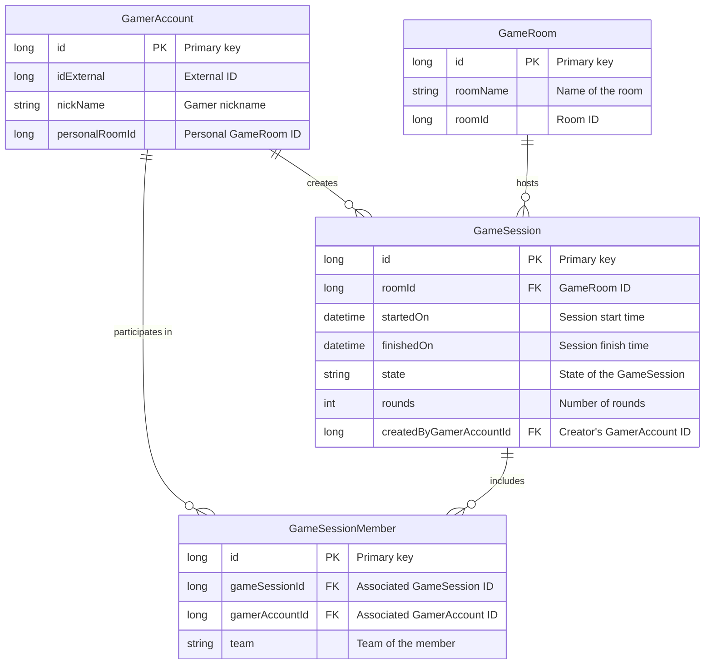

```mermaid
erDiagram

    GamerAccount {
        long id PK "Primary key"
        long idExternal "External ID"
        string nickName "Gamer nickname"
        long personalRoomId "Personal GameRoom ID"
    }

    GameRoom {
        long id PK "Primary key"
        string roomName "Name of the room"
        long roomId "Room ID"
    }

    GameSession {
        long id PK "Primary key"
        long roomId FK "GameRoom ID"
        datetime startedOn "Session start time"
        datetime finishedOn "Session finish time"
        string state "State of the GameSession"
        int rounds "Number of rounds"
        long createdByGamerAccountId FK "Creator's GamerAccount ID"
    }

    GameSessionMember {
        long id PK "Primary key"
        long gameSessionId FK "Associated GameSession ID"
        long gamerAccountId FK "Associated GamerAccount ID"
        string team "Team of the member"
    }

    GamerAccount ||--o{ GameSession : "creates"
    GamerAccount ||--o{ GameSessionMember : "participates in"
    GameSession ||--o{ GameSessionMember : "includes"
    GameRoom ||--o{ GameSession : "hosts"


```